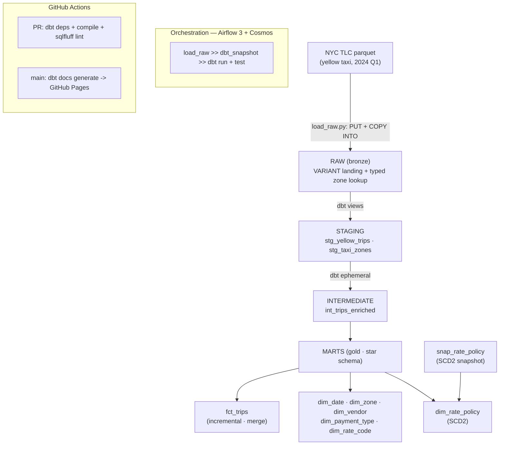

# NYC TLC Analytics — Snowflake + dbt

End-to-end analytics-engineering pipeline on **Snowflake**, modelled with **dbt**, orchestrated by **Apache Airflow 3 (via Cosmos)**, with **GitHub Actions CI** and a **published dbt docs site**.

This is **Project 2** of a four-part portfolio that implements the *same* business problem (a NYC taxi analytics pipeline: ingest → clean → model → serve) across four different stacks, so the engineering trade-offs between platforms can be compared directly rather than in the abstract.

- **Project 1 — GCP + Databricks (Delta Lake):** [`project1-gcp-databricks`](https://github.com/jjsanchezcanton/project1-gcp-databricks)
- **Project 2 — Snowflake + dbt:** this repo
- Project 3 — AWS · Project 4 — Terraform / IaC *(planned)*

---

## Objective

Rebuild the transformation layer of the NYC TLC pipeline on Snowflake, modelled with dbt, to demonstrate senior-level analytics engineering: a clean medallion architecture, an incremental fact model, an SCD2 snapshot over a genuinely-changing dimension, a full test suite, cost-aware warehouse design, and modern orchestration — all reproducible from a clean clone.

## Architecture



**Star schema grain:** `fct_trips` = one taxi trip, with foreign keys to every `dim_*`. Measures: fare, tip, tolls, surcharges, total, distance, duration.

## Tech stack

| Layer | Choice |
|---|---|
| Data warehouse | Snowflake (Standard, `WH_XS` warehouse, auto-suspend 60s) |
| Transformation | dbt-core + dbt-snowflake 1.11.x |
| dbt packages | dbt_utils, codegen |
| Orchestration | Apache Airflow 3.2 |
| dbt ↔ Airflow | astronomer-cosmos (virtualenv execution mode) |
| Ingestion | snowflake-connector-python (PUT + COPY INTO internal stage) |
| Auth | Snowflake key-pair (RSA), GitHub Actions secrets |
| Linting | sqlfluff (Snowflake dialect) |
| CI/CD | GitHub Actions |
| Local env | WSL2 Ubuntu 22.04, Python 3.12 (uv), VS Code Remote-WSL |

## Repository structure

```
project2-snowflake-dbt/
├── ingestion/load_raw.py          # re-download NYC TLC + PUT + COPY INTO RAW
├── snowflake/00_setup.sql         # role, warehouse, db, schemas, stage, raw tables
├── dbt/
│   ├── dbt_project.yml
│   ├── packages.yml
│   ├── profiles.example.yml       # template — real profile lives in ~/.dbt
│   ├── macros/                    # generate_schema_name override
│   ├── models/{staging,intermediate,marts}/
│   ├── seeds/                     # vendor, payment_type, rate_code, rate_policy
│   ├── snapshots/                 # snap_rate_policy (SCD2)
│   └── tests/                     # singular tests
├── airflow/dags/                  # Cosmos DbtTaskGroup DAG
├── .github/workflows/             # ci.yml, docs.yml
└── .env.example                   # env var template (no secrets)
```

## Design decisions

A few choices made deliberately, with the trade-off behind each:

- **Key-pair authentication, not password.** Snowflake is phasing out single-factor password sign-ins for programmatic access through 2026, and a non-interactive script cannot answer an MFA challenge. Key-pair is the recommended path for automated workloads, so the loader, dbt, and Airflow all authenticate with one RSA key — no passwords on disk, MFA-independent, rotation-ready.
- **Bronze as schema-on-read (`VARIANT`).** The raw trips table stores each record as a `VARIANT` rather than fixed columns, so it tolerates the small schema drift between monthly TLC files (for example the `Airport_fee` casing change). Typed extraction happens in dbt staging. The small, stable zone lookup is loaded as typed columns instead — a deliberate schema-on-read vs schema-on-write split.
- **Cost-aware warehouse.** An X-Small warehouse with `AUTO_SUSPEND = 60s` and `INITIALLY_SUSPENDED = TRUE` means compute only bills while a query runs. CI runs `compile` + `lint` only, so pull requests never touch the warehouse and never burn credits.
- **Explicit schema routing.** A `generate_schema_name` override lands models in clean schemas (`STAGING`, `MARTS`) instead of dbt's default target-prefixed names.
- **Honest SCD2 dimension.** The slowly-changing dimension is `rate_policy`, seeded from the real history of NYC's congestion surcharge — a dimension that genuinely changed over time, rather than a synthetic one invented to demonstrate the mechanic.

## Local setup

Prerequisites: WSL2 (Ubuntu 22.04), Python 3.12 via [uv](https://docs.astral.sh/uv/), a Snowflake account.

```bash
# 1. clone
git clone https://github.com/jjsanchezcanton/project2-snowflake-dbt.git
cd project2-snowflake-dbt

# 2. two isolated venvs (dbt and Airflow must not share dependencies)
uv venv .venv-dbt --python 3.12
source .venv-dbt/bin/activate
uv pip install dbt-core dbt-snowflake snowflake-connector-python sqlfluff python-dotenv
deactivate

uv venv .venv-airflow --python 3.12
source .venv-airflow/bin/activate
uv pip install "apache-airflow==3.2.1" \
  --constraint "https://raw.githubusercontent.com/apache/airflow/constraints-3.2.1/constraints-3.12.txt"
uv pip install "astronomer-cosmos[dbt-snowflake]"
deactivate

# 3. configure env + Snowflake key-pair, then provision and load
cp .env.example .env          # fill in your values
#  ... run snowflake/00_setup.sql in Snowsight (role, warehouse, schemas) ...
source .venv-dbt/bin/activate
set -a; source .env; set +a
python ingestion/load_raw.py  # downloads source data, loads RAW

# 4. dbt
cd dbt && dbt deps && dbt debug
```

Authentication uses a Snowflake RSA key pair; the private key and its passphrase stay outside the repository and are referenced through environment variables.

## Status

| Milestone | Scope | Status |
|---|---|---|
| A | Snowflake provisioning + raw load (key-pair, internal stage, COPY INTO) | ✅ Complete |
| B | dbt core models — sources, staging, intermediate, star-schema marts | 🚧 In progress |
| C | Incremental `fct_trips` + SCD2 `rate_policy` snapshot + test suite | ⬜ Planned |
| D | Airflow 3 orchestration via Cosmos | ⬜ Planned |
| E | GitHub Actions CI + published dbt docs site | ⬜ Planned |

## Data source

NYC Taxi & Limousine Commission (TLC) Trip Record Data — public dataset.
<https://www.nyc.gov/site/tlc/about/tlc-trip-record-data.page>

Yellow taxi trip records for 2024 Q1 are used here; volume is intentionally capped to keep the work within a Snowflake trial.

---

*Portfolio project · Juan-Jose Sanchez · Senior Data Engineer.*
