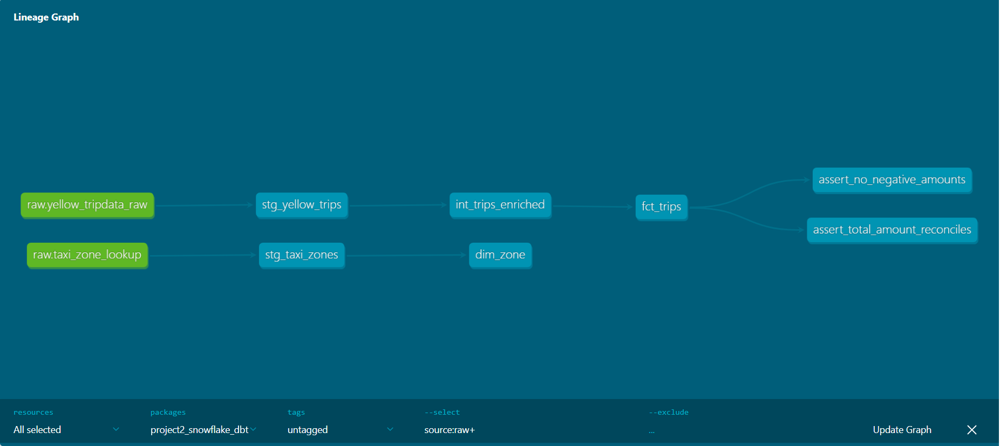
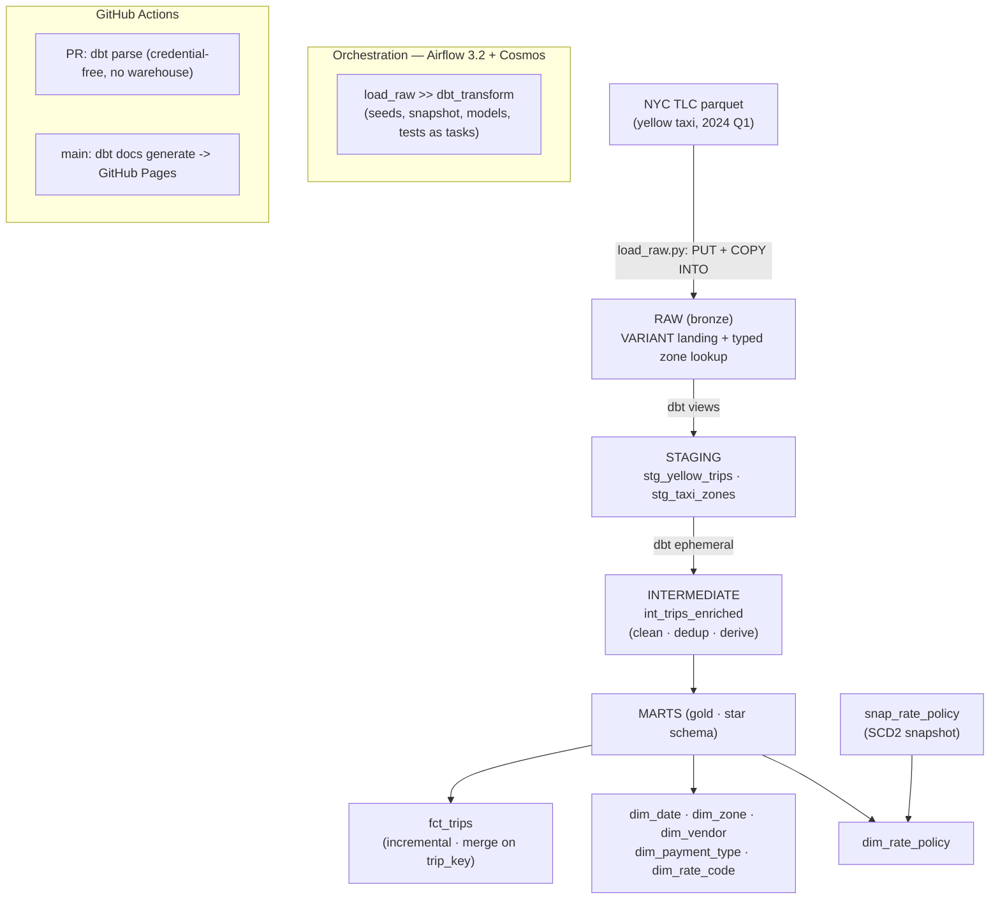
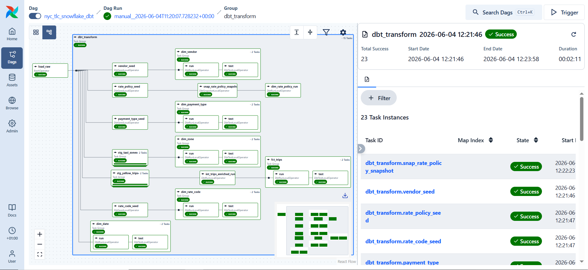
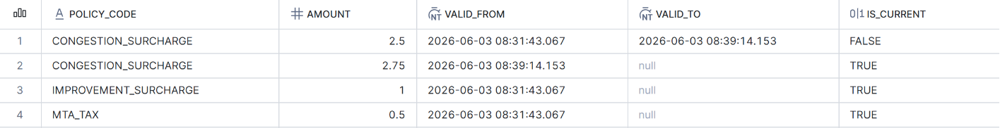
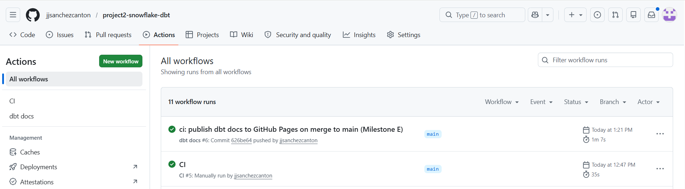

# NYC TLC Analytics — Snowflake + dbt

End-to-end analytics-engineering pipeline on **Snowflake**, modelled with **dbt**, orchestrated by **Apache Airflow 3 (via Cosmos)**, with **GitHub Actions CI** and a **published dbt docs site**.

**Live dbt docs (lineage graph):** https://jjsanchezcanton.github.io/project2-snowflake-dbt/


*Model lineage from the published dbt docs site: RAW → staging → intermediate → star-schema marts, plus the SCD2 snapshot.*

This is **Project 2** of a four-part portfolio that implements the *same* business problem (a NYC taxi analytics pipeline: ingest → clean → model → serve) across four different stacks, so the engineering trade-offs between platforms can be compared directly rather than in the abstract.

- **Project 1 — GCP + Databricks (Delta Lake):** [`project1-gcp-databricks`](https://github.com/jjsanchezcanton/project1-gcp-databricks)
- **Project 2 — Snowflake + dbt:** this repo
- Project 3 — AWS · Project 4 — Terraform / IaC *(planned)*

---

## Objective

Rebuild the transformation layer of the NYC TLC pipeline on Snowflake, modelled with dbt, to demonstrate senior-level analytics engineering: a clean medallion architecture, an incremental fact model, an SCD2 snapshot over a genuinely-changing dimension, a full test suite, cost-aware warehouse design, and modern orchestration — all reproducible from a clean clone.

## Architecture



**Star schema grain:** `fct_trips` = one cleaned taxi trip, with foreign keys to every `dim_*`. Measures: fare, tip, tolls, surcharges, total, distance, duration.

**Orchestration in Airflow (Cosmos):**


*The `nyc_tlc_snowflake_dbt` DAG in Airflow 3.2 — `load_raw` followed by each dbt seed, model, snapshot and test rendered as an individual task by Cosmos.*

## Results

| Metric | Value |
|---|---|
| Raw trips loaded (2024 Q1) | 9,554,778 |
| Clean trips in `fct_trips` | 9,196,733 (~3.7% removed as outliers/duplicates) |
| dbt models / seeds / snapshots | 10 / 4 / 1 |
| dbt data tests | 24 (generic + relationships + singular) |
| Data-quality finding | ~21.3% of trips (1,959,755) fail `total_amount` reconciliation — surfaced as a WARN-severity test, not a build failure (documented below) |

## Tech stack

| Layer | Choice |
|---|---|
| Data warehouse | Snowflake (Standard, `WH_XS` warehouse, auto-suspend 60s) |
| Transformation | dbt-core + dbt-snowflake 1.11.x |
| dbt packages | dbt_utils, codegen |
| Orchestration | Apache Airflow 3.2 |
| dbt ↔ Airflow | astronomer-cosmos — LOCAL execution mode via `dbt_executable_path` |
| Ingestion | snowflake-connector-python (PUT + COPY INTO internal stage) |
| Auth | Snowflake key-pair (RSA); GitHub Actions secrets |
| Linting | sqlfluff (Snowflake dialect, local) |
| CI/CD | GitHub Actions |
| Local env | WSL2 Ubuntu 22.04, Python 3.12 (uv), VS Code Remote-WSL |

## Repository structure

```
project2-snowflake-dbt/
├── ingestion/load_raw.py          # re-download NYC TLC + PUT + COPY INTO RAW
├── snowflake/00_setup.sql         # role, warehouse, db, schemas, stage, raw tables
├── dbt/
│   ├── dbt_project.yml
│   ├── packages.yml
│   ├── profiles.example.yml       # template — real profile lives in ~/.dbt
│   ├── macros/                    # generate_schema_name override
│   ├── models/{staging,intermediate,marts}/
│   ├── seeds/                     # vendor, payment_type, rate_code, rate_policy
│   ├── snapshots/                 # snap_rate_policy (SCD2, YAML-defined)
│   └── tests/                     # singular tests
├── airflow/dags/                  # Cosmos DbtTaskGroup DAG
├── .github/workflows/             # ci.yml (PR), docs.yml (Pages)
├── docs/images/                   # README screenshots
└── .env.example                   # env var template (no secrets)
```

## Design decisions

A few choices made deliberately, with the trade-off behind each:

- **Key-pair authentication, not password.** Snowflake is phasing out single-factor password sign-ins for programmatic access through 2026, and a non-interactive script cannot answer an MFA challenge. Key-pair is the recommended path for automated workloads, so the loader, dbt, and Airflow all authenticate with one RSA key — no passwords on disk, MFA-independent, rotation-ready.
- **Bronze as schema-on-read (`VARIANT`).** The raw trips table stores each record as a `VARIANT` rather than fixed columns, so it tolerates schema drift between monthly TLC files (for example the `Airport_fee` casing). Typed extraction happens in dbt staging. The trip timestamps arrive as epoch microseconds and are cast explicitly with scale 6. The small, stable zone lookup is loaded as typed columns instead — a deliberate schema-on-read vs schema-on-write split.
- **Cost-aware warehouse.** An X-Small warehouse with `AUTO_SUSPEND = 60s` and `INITIALLY_SUSPENDED = TRUE` means compute only bills while a query runs. PR CI runs `dbt parse` with dummy credentials, so pull requests never touch the warehouse and never burn credits.
- **Incremental fact with merge.** `fct_trips` is incremental on a `trip_key` surrogate, using the `merge` strategy and a `max(pickup_at)` watermark guard. A second run with no new data processes zero rows; new rows are merged idempotently.
- **Honest SCD2 dimension.** `rate_policy` (the congestion / MTA / improvement surcharges) is snapshotted with the `check` strategy — a dimension that genuinely changes over time, rather than a synthetic one invented to demonstrate the mechanic.
- **Explicit schema routing.** A `generate_schema_name` override lands models in clean schemas (`STAGING`, `MARTS`) instead of dbt's default target-prefixed names.
- **Cosmos LOCAL mode over VIRTUALENV.** dbt runs in LOCAL execution mode pointing at a dbt executable, reusing the installed environment rather than rebuilding a virtualenv per task — faster, with the dbt project's packages resolved project-locally.


*SCD2 history captured by the `snap_rate_policy` snapshot: after a simulated policy change, the congestion surcharge has a closed historical version (`valid_to` set) and a current one (`valid_to` null).*

## Data-quality finding: `total_amount` reconciliation

A singular test checks whether `total_amount` equals the sum of its fare components. About **21.3% of trips (1,959,755 rows)** do not reconcile — driven largely by how the congestion surcharge is reflected in `total_amount` in the TLC source. This is upstream data quality that cannot be fixed downstream, so the test is configured at **WARN severity**: it surfaces and monitors the discrepancy rate without failing the build. Failing a pipeline on source-data issues outside one's control would be the wrong call; monitoring them is the right one.

## Local setup

Prerequisites: WSL2 (Ubuntu 22.04), Python 3.12 via [uv](https://docs.astral.sh/uv/), a Snowflake account, an RSA key pair registered on the Snowflake user.

```bash
# 1. clone
git clone https://github.com/jjsanchezcanton/project2-snowflake-dbt.git
cd project2-snowflake-dbt

# 2. two isolated venvs (dbt CLI/loader vs Airflow+Cosmos)
uv venv .venv-dbt --python 3.12
source .venv-dbt/bin/activate
uv pip install dbt-core dbt-snowflake snowflake-connector-python sqlfluff python-dotenv
deactivate

uv venv .venv-airflow --python 3.12
source .venv-airflow/bin/activate
uv pip install "apache-airflow==3.2.1" \
  --constraint "https://raw.githubusercontent.com/apache/airflow/constraints-3.2.1/constraints-3.12.txt"
uv pip install "astronomer-cosmos[dbt-snowflake]"
deactivate

# 3. configure env + key-pair, provision, load, transform
cp .env.example .env                       # fill in your values
#  ... run snowflake/00_setup.sql in Snowsight ...
source .venv-dbt/bin/activate
set -a; source .env; set +a
python ingestion/load_raw.py               # downloads source data, loads RAW
cd dbt && dbt build                        # staging -> marts + tests
dbt snapshot                               # SCD2 rate_policy

# 4. orchestrate (separate terminal)
source .venv-airflow/bin/activate
export AIRFLOW_HOME=~/project2-snowflake-dbt/airflow
set -a; source ~/project2-snowflake-dbt/.env; set +a
airflow standalone                         # DAG: nyc_tlc_snowflake_dbt
```

Authentication uses a Snowflake RSA key pair; the private key and its passphrase stay outside the repository and are referenced through environment variables.

## CI/CD

- **`ci.yml`** (on pull request): installs dbt, runs `dbt deps` + `dbt parse` with dummy credentials. Validates that the project parses and all refs/sources resolve — without connecting to Snowflake, so PRs cost nothing.
- **`docs.yml`** (on push to `main`): authenticates with the Snowflake key-pair (GitHub secrets), runs `dbt docs generate`, and publishes the documentation site — including the lineage graph — to GitHub Pages.


*The CI (`dbt parse`) and docs-publish workflows passing in GitHub Actions.*

## Status

| Milestone | Scope | Status |
|---|---|---|
| A | Snowflake provisioning + raw load (key-pair, internal stage, COPY INTO) | ✅ Complete |
| B | dbt core models — sources, staging, intermediate, star-schema marts, tests | ✅ Complete |
| C | Incremental `fct_trips` + SCD2 `rate_policy` snapshot + singular tests | ✅ Complete |
| D | Airflow 3.2 orchestration via Cosmos | ✅ Complete |
| E | GitHub Actions CI + published dbt docs site | ✅ Complete |

## Data source

NYC Taxi & Limousine Commission (TLC) Trip Record Data — public dataset.
<https://www.nyc.gov/site/tlc/about/tlc-trip-record-data.page>

Yellow taxi trip records for 2024 Q1 are used here; volume is intentionally capped to keep the work within a Snowflake trial.

---

*Portfolio project · Juan-Jose Sanchez · Senior Data Engineer.*
